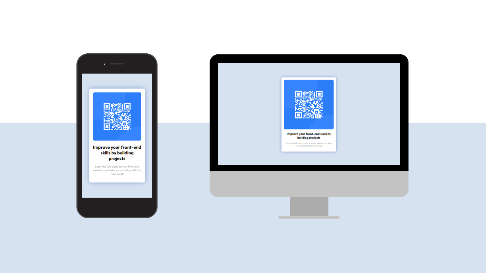

# Make It Real - Stats preview card component

This is a solution to the QR code component project of the Make It Real course.

## Table of contents

- [Overview](#overview)
  - [The challenge](#the-challenge)
  - [Screenshot](#screenshot)
- [My process](#my-process)
  - [Built with](#built-with)
  - [What I learned](#what-i-learned)
  - [Continued development](#continued-development)
  - [Useful resources](#useful-resources)
- [Author](#author)
- [Acknowledgments](#acknowledgments)

## Overview

### The challenge

Users should be able to:

- Build a website based on a design
- Adapt css styling to be responsive

### Screenshot



## My process

To begin with, we set the HTML structure. Then, we worked on css styling. We styled mobile first and once mobile version was all set, we added some minor styling for desktop version.

### Built with

- Semantic HTML5 markup
- CSS custom properties
- Flexbox
- Mobile-first workflow

### What I learned

I remembered a couple of handy css properties:

```css
body {
  display: flex;
  justify-content: center;
  align-items: center;
  min-height: 100vh;
}

.container {
  box-shadow: 0px 0px 26px -2px hsl(218, 44%, 60%);
}
```

### Continued development

I need to keep working on flex properties and box-shadow.

### Useful resources

- [Box Shadow Generator](https://www.cssmatic.com/box-shadow) - This helped us to generate the accurate box shadow.

## Author

- [LinkedIn](https://www.linkedin.com/in/juan-orjuela/)
- [Behance](https://www.behance.net/juan_o)

## Acknowledgments

Special aknowledgments to Yulany Munévar and Juan Lorza, coding partners on this task, and to Germán Escobar, teacher and mentor for supervising our process.
